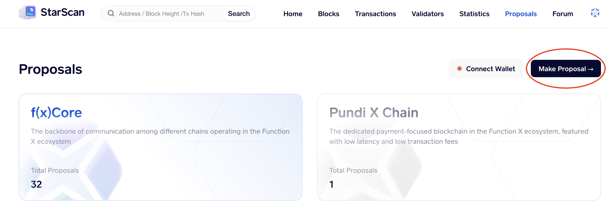

# With Remix

A Hello World style starter project. Deploys a smart contract with a message, and renders it in the front-end. You can change the message using the interactive panel!

This DAPP implements a "Hello World" style application that echoes a message passed to the contract to the front end. This tutorial is intended to be followed using the online IDE available at [Remix IDE](https://remix.ethereum.org).

For more information on Remix and how to use it, you may find it in the [Remix Documentation](https://remix-ide.readthedocs.io/en/latest/index.html).

### Setting up [Remix IDE](https://remix.ethereum.org)

* Remix IDE - an online IDE to develop smart contracts.
* If you’re new to Remix, you’ll first need to activate two modules: **Solidity Compiler** and **Deploy and Run Transactions** (This should already be activated by default without you needing to search for it in the plugin manager).
* Search for **'Solidity Compiler'** in the plugin tab in Remix (this should be activated by default)
* And activate the plugins (if they are not already activated)

.png>).png>)

* The environment should be set to solidity by default
* .png>)Go to File Explorers, .png>)To create a new file , Name it HelloWorld.sol
* **Copy/Paste** the Smart contract below into the newly created file `HelloWorld.sol`


```solidity
// SPDX-License-Identifier: MIT
pragma solidity ^0.8.0;
// Specifies that the source code is for a version
// of Solidity greater than 0.8.10

// A contract is a collection of functions and data (its state)
// that resides at a specific address on the Ethereum blockchain.
contract HelloWorld {

    // The keyword "public" makes variables accessible from outside a contract
    // and creates a function that other contracts or SDKs can call to access the value
    string public message;

    // A special function only run during the creation of the contract
    constructor(string memory initMessage) {
        // Takes a string value and stores the value in the memory data storage area,
        // setting `message` to that value
        message = initMessage;
    }

    // A publicly accessible function that takes a string as a parameter
    // and updates `message`
    function update(string memory newMessage) public {
        message = newMessage;
    }
}
```


The first line, `pragma solidity ^0.8.0` specifies that the source code is for a Solidity version greater than 0.8.0. [Pragmas](https://solidity.readthedocs.io/en/latest/layout-of-source-files.html#pragma) are common instructions for compilers about how to treat the source code (e.g., pragma once).

A contract in the sense of Solidity is a collection of code (its functions) and data (its state) that resides at a specific address on the Ethereum blockchain. The line `string public message` declares a public state variable called `message` of type `string`. You can think of it as a single slot in a database that you can query and alter by calling functions of the code that manages the database. The keyword public automatically generates a function that allows you to access the current value of the state variable from outside of the contract. Without this keyword, other contracts have no way to access the variable.

The [constructor](https://solidity.readthedocs.io/en/latest/contracts.html#constructor) is a special function run during the creation of the contract and cannot be called afterward. In this case, it takes a string value `initMessage`, stores the value in the [memory](https://solidity.readthedocs.io/en/latest/introduction-to-smart-contracts.html#storage-memory-and-the-stack) data storage area, and sets `message` to that value.

The `string public message` function is another public function that is similar to the constructor, taking a string as a parameter, and updating the `message` variable.

### Compile Smart Contract

* .png>) Go to Solidity Compiler
* Select Compiler Version to 0.8.0
* Now, `Compile HelloWorld.sol`
* After Successful Compilation, it will show .png>)
* Now, we have to deploy our smart contract on f(x)Core Network. For that, we have to connect to web3, this can be done by using services like Metamask. We will be using Metamask. Please follow this tutorial to setup a Metamask Account.
* Open Metamask, click the **network dropdown** and then click **'Add Network'**

.png>)

* Put in a Network name (just an example):

```
fxtothemoon
```

* In New RPC URL field you can add the URL:

```
https://testnet-fx-json-web3.functionx.io:8545
```

* Enter the Chain ID:

```
90001
```

* (Optional Field) Currency Symbol (just an example):

```
FX
```

* (Optional Field) Block Explorer URL:&#x20;

```
https://testnet-fxscan.functionx.io/
```

.png>)

* Click Save
* Copy your address from Metamask

.png>)

* Head over to [faucet](https://dhobyghaut-faucet.functionx.io) and request test FX - you will need this to pay for gas on f(x)Core. After inputting your wallet address in, select the option **'100 (fxCore) FX / 24h'**.
* Now, let's Deploy the Smart Contract to the f(x)Core Network
* Select Injected Web3 in the Environment dropdown ensure you have selected the right contract too.
* Accept the connection request by clicking **Next** in Metamask after choosing the account



* Once Metamask is connected to Remix, the ‘Deploy’ transaction would generate another metamask popup that requires transaction confirmation.
* Click the <mark style="color:blue;">**EDIT**</mark> button (1st picture) and then the <mark style="color:orange;">**Edit suggested gas fee**</mark> (2nd picture) before editing the **Max priority fee** and **Max fee** to 4000 Gwei then click **SAVE**.

.png>)

* Click **Confirm**

.png>)

**Congratulations!** You have successfully deployed HelloWorld Smart Contract. Now you can interact with the Smart Contract. Check the deployment status [here](https://testnet-fxscan.functionx.io).

.png>)

